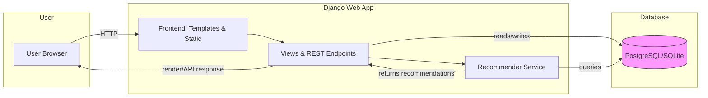
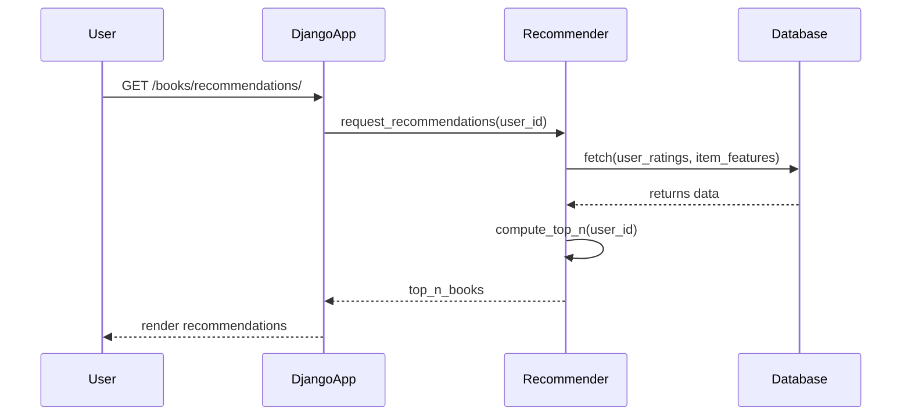
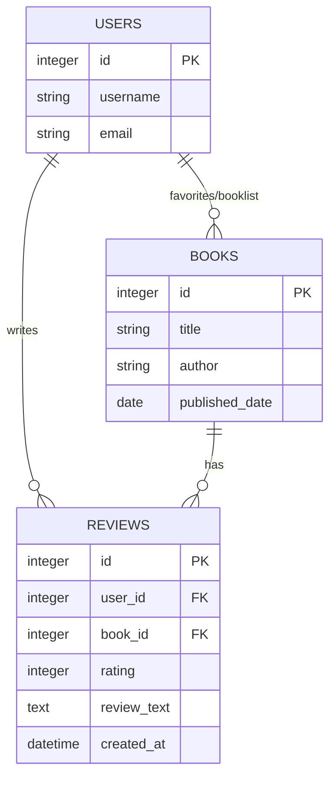
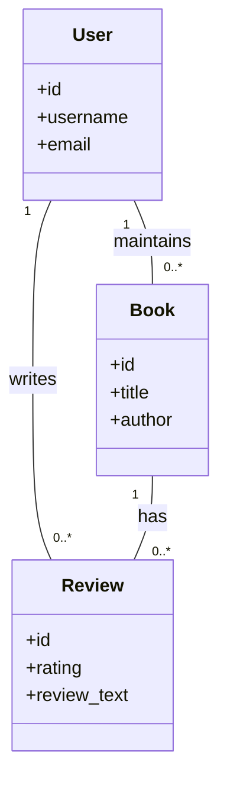

# Intelligent Book Recommendation Engine
**Production-Ready Django Backend with Machine Learning Integration**

A sophisticated full-stack book recommendation platform showcasing **backend expertise in ML pipeline integration, scalable Django architecture, and sophisticated recommendation algorithms**. This project demonstrates the ability to architect, build, and deploy intelligent systems that combine Django's robustness with machine learning capabilities.

> **Key Showcase:** Multi-app Django architecture + Collaborative filtering/ML recommendation logic + REST API design + Database optimization

## Table of Contents

- What This Demonstrates
- Technical Features
- Quick Start
- Project Structure
- System Architecture
  - System Overview
  - Recommendation Pipeline
  - Data Models
- Testing
- Architecture & Design Patterns
- Contributing
- License

## What This Demonstrates

A **production-grade recommendation system** combining multiple technical competencies:

| Component | Technology | Highlights |
|-----------|-----------|------------|
| **Backend** | Django, Python | Multi-app architecture, middleware expertise, ORM optimization |
| **ML/Algorithms** | Scikit-learn, Collaborative Filtering | Ranking algorithms, feature engineering, model persistence |
| **Data Layer** | PostgreSQL/SQLite | Query optimization, relationship modeling, data integrity |
| **API** | REST endpoints | Clean API design, serialization, versioning considerations |
| **Infrastructure** | WSGI/ASGI, Static files | Production deployment patterns, S3 integration, media handling |

**Technical Approach:** Separated ML training from inference, reproducible pipelines, scalable async-ready architecture

## Technical Features

- **User Authentication & Authorization** — Secure account management with Django's battle-tested auth system
- **Advanced Recommendation Engine** — ML-driven personalization with cold-start handling
- **RESTful API** — Versioned endpoints with proper HTTP semantics
- **Multi-app Modular Architecture** — Scalable structure supporting team collaboration
- **Full-text Search & Filtering** — Optimized queries for large datasets
- **Production-Ready** — Includes testing, logging, and deployment patterns
- **ML Pipeline Integration** — Model versioning, offline training, real-time inference

## Quick Start (Windows PowerShell)

Open PowerShell in the repository root (where `manage.py` is located) and run:

```powershell
# Create and activate a virtual environment
python -m venv .venv; .\.venv\Scripts\Activate.ps1

# Install dependencies
pip install -r requirements.txt

# Apply migrations
python manage.py migrate

# (Optional) Create a superuser
python manage.py createsuperuser

# Collect static files (if needed)
python manage.py collectstatic --noinput

# Run the development server
python manage.py runserver
```

Open http://127.0.0.1:8000/ in your browser.

Notes:
- The project expects a `media/` directory for uploaded files and `static/` for static assets (already present in the repo).
- If you plan to run long-running training jobs, consider isolating them into separate scripts or a background worker.

## Project Structure

```
├── manage.py                 # Django CLI
├── djBooks/                  # Core configuration
│   ├── settings.py          # Settings (environment-aware)
│   ├── wsgi.py              # Production server entry
│   └── asgi.py              # Async server entry
├── accounts/                # Authentication module
│   ├── models.py            # User profile, permissions
│   ├── views.py             # Auth endpoints
│   └── serializers.py       # API serialization
├── books/                   # Core recommendation engine
│   ├── models.py            # Book, Review, Rating models
│   ├── views.py             # Book list, detail, recommendation views
│   ├── utils.py             # ML/recommendation logic
│   └── api/                 # REST API endpoints
├── recommender/             # ML service layer (extensible)
├── pages/, searchs/         # Supporting apps
├── templates/, static/      # Frontend assets
└── requirements.txt         # Python dependencies (pinned versions)
```

## System Architecture

Below are architectural diagrams illustrating the system design, ML recommendation pipeline, and data model relationships:

### System Overview



### Recommendation Pipeline (Sequence Diagram)



### Data Models (ER / Class Diagram)



And a compact class-style diagram to visualize relationships between the main Django models:



If you extend the recommender to use a separate microservice (e.g., FastAPI, Flask), update the system overview to show the service and a message/broker or REST link.

## Testing & Quality

Run the Django test suite:

```powershell
python manage.py test
```

**Testing Strategy:**
- Unit tests for ML feature extraction and ranking algorithms
- Integration tests verifying API responses and recommendation accuracy
- Database query optimization tests
- Mock external service calls for reproducibility

## Architecture & Design Patterns

**Separation of Concerns:**
- ML training decoupled from request-time inference (background tasks ready)
- Models persisted and versioned in `models/` directory
- Async-ready design for background job processing

**Production Optimization:**
- Static files CDN-ready (CloudFront/CloudFlare compatible)
- Media storage backends abstracted (S3, Azure Blob, GCS)
- Database connection pooling and query optimization
- ASGI support for concurrent request handling

**Code Organization:**
- Modular `recommender/` service layer for algorithm independence
- Clear separation: Django views → recommendation service → ML models
- Testable interfaces and dependency injection patterns
- Error handling and logging for production observability

## Contributing

Contributions are welcome! The project follows professional software engineering practices:

1. **Fork & Branch** — Create a feature branch: `git checkout -b feat/your-feature`
2. **Develop** — Add tests before implementation (TDD approach)
3. **Test** — Ensure all tests pass: `python manage.py test`
4. **Document** — Update docstrings and architecture notes
5. **Submit PR** — Include a detailed description of changes and reasoning

**Code Standards:**
- Follow PEP 8 style guide
- Write testable, modular code
- Focus on small, reviewable pull requests
- Include docstrings for public APIs

## Next Steps for Enhancement

This project can be extended with:
- **Real-time recommendations** using Celery + Redis
- **Advanced ML** (matrix factorization, deep learning with TensorFlow)
- **Microservice deployment** using Docker + Kubernetes
- **Analytics dashboard** for monitoring recommendation quality
- **A/B testing framework** for algorithm comparison


