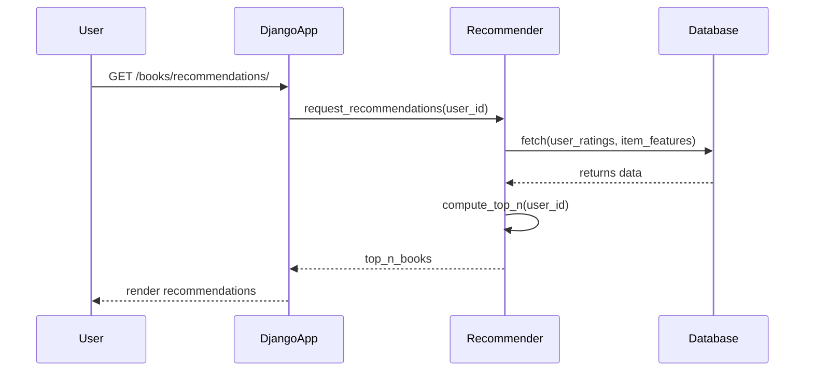
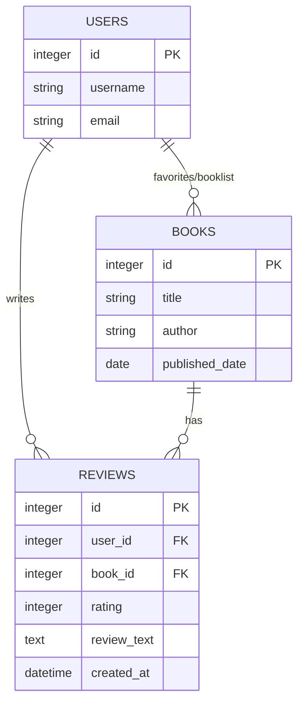
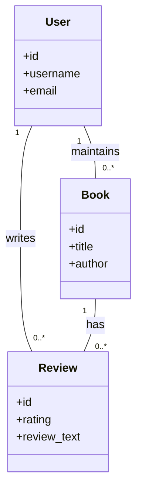

# Book Recommendation System (Using ML and Django)

A simple, extensible Django project that demonstrates a book recommendation system using machine learning techniques alongside a standard Django web app structure. This repository contains the Django project, apps for accounts, books, pages, search, and a lightweight recommender integration.

## Table of Contents

- [Overview](#overview)
- [Features](#features)
- [Quick start (Windows PowerShell)](#quick-start-windows-powershell)
- [Project structure](#project-structure)
- [Architecture & Diagrams](#architecture--diagrams)
  - [System overview](#system-overview)
  - [Recommendation data flow (sequence)](#recommendation-data-flow-sequence)
  - [Data model (ER / class diagram)](#data-model-er--class-diagram)
- [Running tests](#running-tests)
- [Development notes](#development-notes)
- [Contributing](#contributing)
- [License](#license)

## Overview

This project implements a book recommendation web application built with Django. It includes:

- User account management (`accounts` app)
- Book catalog, reviews, and recommendation logic (`books` app)
- Static pages and helpers (`pages` app)
- Search and filter UI (`searchs` app)
- A small REST-ish API surface under `books/api`

The recommender component uses offline or lightweight ML logic (can be extended to matrix factorization, collaborative filtering, or content-based methods). The ML code and data preparation live alongside the Django app for reproducibility.

## Features

- User authentication and profile management
- Book listing, detail pages, user reviews and ratings
- Per-user booklists and recommendations
- Search and filter UI
- API endpoints for basic book and recommendation data

## Quick start (Windows PowerShell)

Open PowerShell in the repository root (where `manage.py` is located) and run:

```powershell
# Create and activate a virtual environment
python -m venv .venv; .\.venv\Scripts\Activate.ps1

# Install dependencies
pip install -r requirements.txt

# Apply migrations
python manage.py migrate

# (Optional) Create a superuser
python manage.py createsuperuser

# Collect static files (if needed)
python manage.py collectstatic --noinput

# Run the development server
python manage.py runserver
```

Open http://127.0.0.1:8000/ in your browser.

Notes:
- The project expects a `media/` directory for uploaded files and `static/` for static assets (already present in the repo).
- If you plan to run long-running training jobs, consider isolating them into separate scripts or a background worker.

## Project structure

Top-level files/folders of interest:

- `manage.py` — Django management script
- `djBooks/` — Django project settings and wsgi/asgi
- `accounts/` — user auth, forms, serializers and views
- `books/` — core app: models, views, recommendation logic, API
- `pages/`, `searchs/` — supporting apps for pages and search
- `templates/`, `static/`, `media/` — UI templates and assets
- `requirements.txt` — Python dependencies

## Architecture & Diagrams

Below are diagrams that explain the high-level system, the recommendation data flow, and the main data models. These are written as mermaid diagrams — many Markdown renderers (GitHub, GitLab, VS Code preview with Mermaid extension) support them.

### System overview

```mermaid
flowchart LR
    subgraph User
        U[User Browser]
    end
    subgraph WebApp[DJango Web App]
        W1[Frontend (templates/static)]
        W2[Views & REST endpoints]
        W3[Recommender Service / Module]
    end
    subgraph DB[Database]
        DB1[(Postgres / SQLite)]
    end
    U -->|HTTP| W1
    W1 --> W2
    W2 -->|reads/writes| DB1
    W2 --> W3
    W3 -->|queries| DB1
    W3 -->|returns recommendations| W2
    W2 -->|render/API response| U

    classDef db fill:#f9f,stroke:#333,stroke-width:1px
    class DB1 db
```

### Recommendation data flow (sequence)



### Data model (ER / class diagram)



And a compact class-style diagram to visualize relationships between the main Django models:



If you extend the recommender to use a separate microservice (e.g., FastAPI Flask), update the system overview to show the service and a message/broker or REST link.

## Running tests

Run the Django test suite:

```powershell
python manage.py test
```

Add tests for new recommendation logic. Consider small unit tests for:

- Data preparation and feature extraction
- Ranking/prediction outputs for known inputs
- Integration tests that ensure the view returns 200 and contains expected context keys

## Development notes

- Recommendation logic in `books/utils.py` or `books/api` can be refactored into a `recommender/` module for clarity.
- Keep ML training separate from request-time prediction. Persist models to `models/` or `data/` and load them at startup or via a background task.
- For production, serve static files via a CDN and media via a storage backend (S3, Azure Blob).

## Contributing

Contributions are welcome. A typical flow:

1. Fork the repo
2. Create a feature branch: `git checkout -b feat/your-feature`
3. Add tests and make changes
4. Open a pull request describing the change

Please follow the existing code style and add small, focused PRs.

